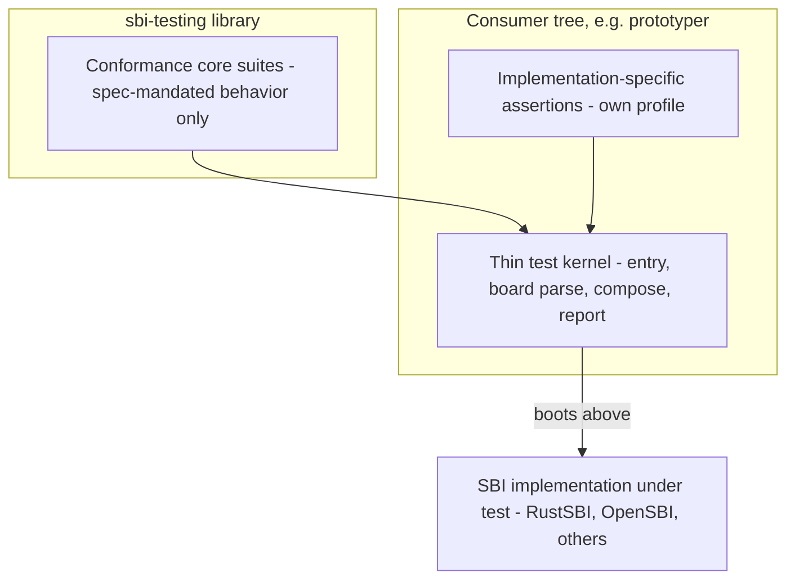

# sbi-testing Universal Conformance Core - Plan

## Goal Capsule

- **Objective:** Reshape `sbi-testing` into a universal, implementation-agnostic SBI conformance test library, and consolidate the current codebase on the principle "conformance core lives in the library, implementation-specific adaptation lives in the consumer."
- **Product authority:** This document. Surrounding areas queued from the same review session (RV32 redo, CI cache governance, upstream macro redesign) are not active scope.
- **Open blockers:** None.

---

## Product Contract

### Summary

`sbi-testing` becomes a pure SBI-spec conformance suite whose composable building blocks any SBI implementation can adopt optionally. The near-term work consolidates the current split test logic onto that boundary: spec-level cases move into the library, and `test-kernel` shrinks to entry code, board parsing, and Prototyper-specific assertions.

### Problem Frame

The official book bills `sbi-testing` as one of RustSBI's four core libraries — a public "SBI compliance test solution" (`docs/src/chapter_02_libraries.md`) — yet its dedicated doc page (`docs/src/02_libraries/04_sbi_testing.md`) is an empty stub, three of eight extension suites are commented out, and its only real consumer is the in-repo `test-kernel`. The billing says public product; the investment says internal helper.

Meanwhile the test logic has split across two homes. `sbi-testing` holds five spec-conformance suites, while `prototyper/test-kernel/src/main.rs` carries PMU tests, fence tests, and a DBCN regression inline. The split is arbitrary, not principled: some of the kernel-side cases are spec-level conformance (they belong in the library), while others encode Prototyper- or qemu-specific behavior (they can never run against a reference implementation like OpenSBI). Today nothing marks the difference, and the library's aggregate API offers no way for a consumer to compose core suites with its own additional cases.

The one piece of evidence that the library is more than an internal helper: the same suite passes against OpenSBI (RV32) and against RustSBI (RV64). That is a conformance product in embryo.

### Key Decisions

- **Universal conformance library, optional adoption.** `sbi-testing` is positioned as an implementation-agnostic SBI conformance library that any implementation (OpenSBI-based firmware, RustSBI-based firmware, others) may adopt or ignore. (session-settled: user-directed — chosen over absorbing tests into `test-kernel` and over remaining an internal-only tool: the library should be the single principled home of SBI conformance logic.) Governs R1, R2.
- **Layering is the principle; profiles belong to the consumer.** The library ships only the conformance core. Each implementation owns its adaptation layer — its implementation-specific assertions — in its own tree. No profile or capability mechanism is built into the library. (session-settled: user-directed — chosen over an in-library profile mechanism: keeps the library pure and avoids a mechanism with only one consumer.) Governs R2, R3, R6.
- **Near-term scope is consolidating current code only.** Prebuilt kernel images, a standardized conformance report format, and ecosystem documentation are deferred. (session-settled: user-directed — chosen over immediate ecosystem productization: design the boundary first, productize later.) Governs R5, R6.

### Requirements

**Purity of the core**

- R1. The core suite asserts only behavior mandated by the RISC-V SBI specification; every core case passes against any compliant implementation, including a reference implementation such as OpenSBI.
- R2. No assertion that encodes one implementation's specific behavior (parameter-validation choices, environment-specific counter values) enters the core suite.

**Composable suite API**

- R3. Suites are exposed as composable building blocks, so a consumer runs core suites interleaved with its own additional cases and produces one coherent report — replacing today's single aggregate entry point.
- R4. Case outcomes keep a uniform, machine-recognizable shape (pass / fail / not-present), and the existing per-suite output line contract consumed by CI grep stays stable.

**Consolidation of current code**

- R5. Spec-conformance test logic currently inline in `prototyper/test-kernel` (fence cases, spec-level PMU cases, the DBCN upper-half regression) moves into the library as core suites.
- R6. `test-kernel` shrinks to entry, board-info parsing, suite invocation, and Prototyper-specific assertions; it holds no spec-conformance assertions after the consolidation.
- R7. `bench-kernel` depends on `sbi-rt` directly instead of borrowing the re-export through `sbi-testing`.

**Regression safety**

- R8. The existing RV64 CI gate (Prototyper qemu boot) stays green with the thinned kernel, against the same pass criteria.

### Key Flows

- F1. Consumer adopts the conformance core
  - **Trigger:** An implementation developer wants to validate an SBI implementation.
  - **Steps:** Compose core suites with any implementation-specific cases; build as a test payload; boot it above the implementation under test; read the per-suite report.
  - **Outcome:** A single coherent conformance report in which every line is traceable to either the spec core or the consumer's own profile.
  - **Covers R1, R3, R4**

The prose above stands alone; the diagram only restates the allocation boundary.

### Acceptance Examples

- AE1. **Given** the suite composed with no implementation-specific cases, **when** it runs above OpenSBI, **then** every core case passes and no Prototyper-specific assertion executes. **Covers R1, R2.**
- AE2. **Given** an extension unavailable on the implementation under test, **when** its suite runs, **then** the case reports not-present rather than failure. **Covers R1, R4.**
- AE3. **Given** the consolidated `test-kernel` built for RustSBI Prototyper, **when** the RV64 CI job boots it, **then** core cases plus Prototyper's own assertions run and the gate stays green. **Covers R5, R6, R8.**

### Scope Boundaries

**Deferred for later**

- RV32 support, redone on the consolidated boundary as a separate work item; the prior attempt is preserved at branch `backup/optimize-sbi-testing-rv32-before-redesign-20260811`.
- Prebuilt test-kernel images for non-Rust implementations, a standardized machine-readable conformance report format, and filling the empty book page `docs/src/02_libraries/04_sbi_testing.md` — all part of ecosystem productization.
- An in-library profile/capability mechanism, if a second real consumer ever needs one.

**Outside this product's identity**

- Platform or peripheral driver testing: the library verifies the SBI interface, not hardware-specific behavior.
- Hypervisor-extension testing beyond what the SBI specification mandates for the supervisor interface.

### Dependencies / Assumptions

- Assumption: adoption demand from non-Rust implementations is unvalidated. Universality functions as a design constraint in the near term; RustSBI's own CI gates are the immediate consumers.
- Dependency: `.github/scripts/prototyper-qemu-boot.sh` greps per-suite output lines; R4's stability constraint keeps that gate working, or the script is updated in the same change.

### Outstanding Questions

- Deferred to Planning: the composable suite API shape — how consumers register, sequence, and aggregate cases (R3).
- Deferred to Planning: where Prototyper-specific assertions live within the prototyper tree after the split (R6).
- Deferred to Planning: whether the kernel-side PMU and fence cases separate cleanly into spec-level and environment-specific parts (R5).

<!-- ce-section: work-relationships -->
### How This Work Fits Together

This plan owns the sbi-testing repositioning and consolidation. The surrounding areas below are the current understanding from the same review session, not a committed roadmap.

- RV32 support redo — **Depends on** this plan's consolidated boundary; preserved on branch `backup/optimize-sbi-testing-rv32-before-redesign-20260811`.
- CI cache and external-dependency governance (cache keys, tag vs SHA pinning) — **Can proceed independently** of this plan.
- `riscv` crate macro-layer redesign proposal (upstream `rust-embedded/riscv`) — **Can proceed independently** of this plan.
