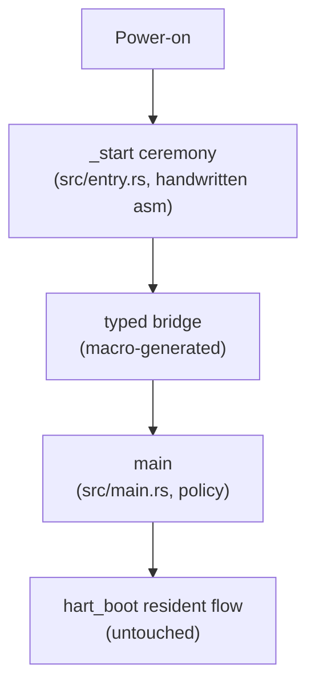

# Prototyper Entry Mechanism Separation - Plan

## Goal Capsule

- **Objective:** Separate the boot entry mechanism from policy in `rustsbi-prototyper` on the `main` branch: move the `_start` assembly ceremony into a handwritten `prototyper/prototyper/src/entry.rs`, and introduce a thin proc macro as the typed seam between that mechanism and the policy main.
- **Product authority:** This document. Later entry-adjacent iterations (resident trap/boot mechanism, firmware protocol typing, deeper macro absorption) are not active scope.
- **Open blockers:** None.
- **Stop conditions:** Any change in boot behavior observed under the QEMU boot matrix; any need to edit ceremony logic rather than move it.

---

## Product Contract

### Summary

Move the `_start` ceremony chain out of `main.rs` into a single handwritten `src/entry.rs` with documented safety contracts, leaving `main.rs` as policy only. Add a thin proc macro attribute that enforces the policy main's signature at compile time and links it to the entry code. The refactor preserves behavior exactly.

### Problem Frame

`prototyper/prototyper/src/main.rs` today mixes two kinds of code: the naked-asm machine startup ceremony (`_start` — hart race, relocation, BSS clear, stack locate — plus `relocation_update`) and the safe-Rust boot policy (`rust_main` — platform discovery, PMP, CSR delegation). The ceremony is the soundness boundary of the whole image, yet it sits inline beside policy, with the boot-hart race and bss-ready signal words embedded as data inside the `.text.entry` function body. Reading or changing boot policy requires parsing the assembly ceremony first; editing the ceremony risks touching policy. The `refactor-prototyper` branch demonstrates the target mechanism/policy separation but restructures far more than this iteration intends.

### Key Decisions

- **Thin macro + handwritten `_start`.** The proc macro generates only the typed bridge (signature enforcement plus a fixed link symbol); `_start` stays handwritten in `src/entry.rs`. (session-settled: user-directed — chosen over a macro-generated `_start` trampoline: in a single crate the extra generated layer adds indirection without payoff, and the user directed maximum simplicity.) Governs R2, R3.
- **Pure move, no logic edits.** The ceremony is relocated verbatim; readability gains come from placement and documentation, not from changing the assembly. (session-settled: user-approved — proposed to keep the iteration small and reviewable; user assented.) Governs R1, R2.
- **Proc macro is in, kept minimal.** A proc-macro crate is introduced now so later iterations can grow it into the unsafe-absorbing seam. (session-settled: user-directed — the user set the proc-macro goal and confirmed inclusion after weighing a no-macro first version.) Governs R3.
- **Develop on `main`; `refactor-prototyper` is reference only.** (session-settled: user-directed — chosen over basing the work on the `refactor-prototyper` branch: that branch's broader restructure is not being adopted.) Governs R1.

### Requirements

- R1. The refactor preserves behavior exactly: the firmware boots identically and the existing QEMU boot tests pass, with no functional change.
- R2. The `_start` ceremony chain — hart race, `relocation_update`, BSS clear, bss-ready synchronization, stack-locate call, and the mscratch/`hart_boot` tail — moves verbatim from `prototyper/prototyper/src/main.rs` into a handwritten `prototyper/prototyper/src/entry.rs`, with safety contracts documented at the mechanism boundary.
- R3. A thin proc macro provides an `entry` attribute for the policy main: it enforces the policy function's signature at compile time and connects it to the entry code. The macro generates no startup assembly.
- R4. After the move, `main.rs` carries policy code only (the current `rust_main` body), annotated with the macro attribute.

### Success Criteria

- Builds for `riscv64gc-unknown-none-elf` and the existing QEMU boot tests pass (covers R1).
- `src/entry.rs` reads standalone: a reviewer can audit the entry mechanism without opening `main.rs`.

### Scope Boundaries

Deferred for later:

- Macro-generated `_start` and any further absorption of unsafe into the macro.
- Resident trap/boot mechanism (`trap_stack`, `trap::boot`, `PLATFORM` statics).
- Firmware boot-protocol typing (dynamic/jump/payload, typed boot-info).
- Signal-word relocation out of `.text.entry` and other ceremony-logic cleanups (blocked by the verbatim-move rule, per R2).
- Porting any other `refactor-prototyper` restructure (for example a machine crate).
- RV32 support for the prototyper binary.

### Sources / Research

- Code to move: `prototyper/prototyper/src/main.rs` (`_start`, `relocation_update`); linker script embedded in `prototyper/prototyper/build.rs` (`ENTRY(_start)`, `.text.entry`).
- Reference design, not to be ported wholesale: branch `refactor-prototyper`, `prototyper/machine/macros/src/lib.rs` and `prototyper/machine/src/entry/`.
- Existing macro-crate convention in this repo: `library/macros` (crate `rustsbi-macros`).
- Verification entry points: `cargo prototyper` build matrix and `.github/scripts/prototyper-qemu-boot.sh` (used by `.github/workflows/prototyper.yml`).

---

## Planning Contract

Product Contract preservation: unchanged in meaning; the two Outstanding Questions resolved into KTD1 and KTD2 without scope change.

### Key Technical Decisions

- KTD1. **Macro crate at `prototyper/macros`, package `entry-macros`, attribute `#[entry]`.** A new proc-macro crate beside the prototyper binary provides the entry attribute; it is added to workspace `members` but not `default-members`. (session-settled: user-directed — chosen over `prototyper-macros::main` and over folding into `library/macros`: keeps the `entry` vocabulary consistent across branch, module, and macro, and keeps a firmware-specific macro out of the public library macro crate.) Governs R3.
- KTD2. **Policy main keeps its current raw signature.** The attribute enforces `fn(usize, usize, usize)` corresponding to the entry ABI `hart_id`, `opaque`, `nonstandard_a2`; a typed/structured entry-argument type waits for the firmware-protocol typing iteration. Governs R3, R4.
- KTD3. **Fixed bridge symbol connects mechanism and policy.** The macro expansion exports a bridge under a reserved symbol name (reference: `__rustsbi_prototyper_main` on the `refactor-prototyper` branch) that forwards to the annotated policy function; `src/entry.rs` declares that symbol `extern` and the `_start` assembly calls it in place of today's direct `call rust_main`. Governs R2, R3.

### High-Level Technical Design

The flow diagram in the Product Contract Summary carries the architecture: one handwritten mechanism file, one macro-generated bridge, one policy file. No further design shape is needed at this size.

---

## Implementation Units

### U1. Entry macro crate

- **Goal:** Create the `entry-macros` proc-macro crate whose `#[entry]` attribute generates the typed bridge for the policy main.
- **Requirements:** R3
- **Dependencies:** none
- **Files:**
  - `prototyper/macros/Cargo.toml` (create)
  - `prototyper/macros/src/lib.rs` (create)
  - `Cargo.toml` (workspace `members` gains `prototyper/macros`)
- **Approach:**
  1. Attribute takes no arguments and applies only to functions; violations produce `compile_error!`.
  2. Expansion keeps the annotated function and adds one `const _: () = { ... }` block exporting the bridge under the reserved symbol (per KTD3); the bridge binds the annotated function to a `fn(usize, usize, usize)` pointer so a wrong signature fails compilation.
  3. Mirror the structure and host-side unit-test style of `prototyper/machine/macros/src/lib.rs` on the `refactor-prototyper` branch.
- **Patterns to follow:** `prototyper/machine/macros/src/lib.rs` (branch `refactor-prototyper`) for expansion shape and tests; `library/macros` for crate packaging conventions.
- **Test scenarios:**
  - Happy path: expansion of `#[entry] fn main(a: usize, b: usize, c: usize) { ... }` contains exactly one bridge export under the reserved symbol and one signature-check binding.
  - Error path: attribute applied to a non-function item produces a compile error.
  - Error path: attribute with arguments produces a compile error.
- **Verification:** `cargo test -p entry-macros` passes on the host; the crate builds as a workspace member.

### U2. Move the entry ceremony into `src/entry.rs`

- **Goal:** Relocate the `_start` ceremony chain and `relocation_update` from `main.rs` into a handwritten `src/entry.rs`, and rewire the policy main through the macro bridge.
- **Requirements:** R1, R2, R4
- **Dependencies:** U1
- **Files:**
  - `prototyper/prototyper/src/entry.rs` (create)
  - `prototyper/prototyper/src/main.rs` (modify)
  - `prototyper/prototyper/Cargo.toml` (add `entry-macros` dependency)
- **Approach:**
  1. Move `_start` and `relocation_update` into `src/entry.rs` verbatim, including the `.text.entry` placement, the embedded signal words, and the `csrw mscratch, sp; j hart_boot` tail (per R2).
  2. Change exactly one assembly operand: the `call` target becomes the reserved bridge symbol (per KTD3) instead of `rust_main`; declare the symbol `extern` in `src/entry.rs`.
  3. Document the safety contract at the mechanism boundary: what the previous stage must provide, and what the ceremony guarantees before the policy main runs.
  4. In `main.rs`: register `mod entry;`, remove the moved functions, and annotate the policy function with `#[entry]` (per KTD2). Policy logic itself stays untouched.
- **Patterns to follow:** Safety-documentation style of `prototyper/machine/src/entry/` on the `refactor-prototyper` branch.
- **Test scenarios:**
  - Integration: default (dynamic) build boots the test kernel under QEMU to the same success markers as before the move (covers R1).
  - Integration: `--jump` and `--payload` builds boot under QEMU identically to before the move.
  - Integration: bench-kernel boot under QEMU unchanged for all three modes.
  - Edge: the linked image still enters at `_start` in `.text.entry` — verified implicitly by every successful boot above.
- **Verification:** The full Verification Contract below passes; a diff of the moved assembly against the original shows a verbatim move plus the single `call`-target change from Approach step 2.

---

## Verification Contract

| Gate | Command | Proves |
|---|---|---|
| Macro unit tests | `cargo test -p entry-macros` | U1 bridge generation and error paths |
| Build, dynamic mode | `cargo prototyper` | U2 compiles and links into a bootable image |
| Build, jump mode | `cargo prototyper --jump` | U2 under the jump feature |
| Build, payload mode | `cargo test-kernel` then `cargo prototyper --payload target/riscv64imac-unknown-none-elf/release/rustsbi-test-kernel.bin` | U2 under the payload feature |
| QEMU boot matrix | `.github/scripts/prototyper-qemu-boot.sh {payload\|dynamic\|jump} {test\|bench}` | R1 behavior preservation across modes and kernels |
| Style | `cargo fmt --check` and clippy on the touched crates | Repo hygiene |

---

## Definition of Done

- Global: every Verification Contract gate passes; boot logs under the QEMU matrix match pre-refactor behavior.
- U1: `#[entry]` expansion, signature enforcement, and error paths are covered by host unit tests.
- U2: `src/entry.rs` holds the complete ceremony with documented safety contracts; `main.rs` holds policy only; the moved assembly is verbatim except the single `call`-target change.
- Cleanup: no leftover experiment code, dead re-exports, or commented-out ceremony remains in the diff.
