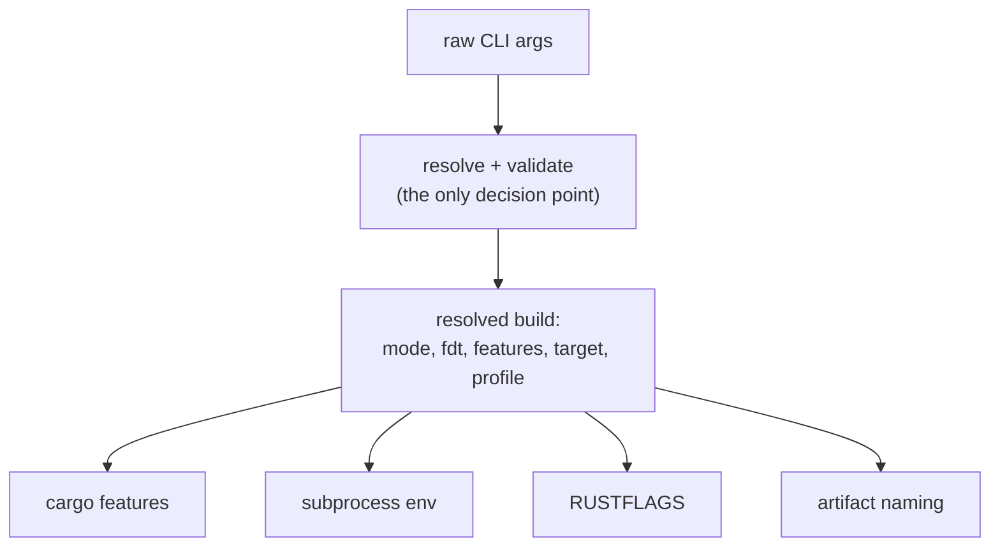
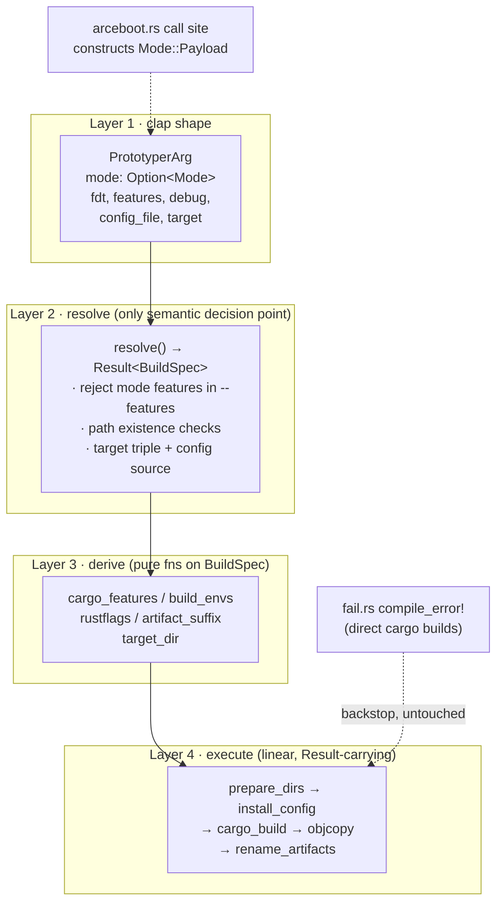

# xtask Prototyper CLI Hardening - Plan

## Goal Capsule

- **Objective:** Harden the `cargo prototyper` build path in `xtask`: the firmware mode becomes an explicit, validated value resolved once at the CLI boundary, every build input is visible on the command line, platform-address drift fails the build loudly, and failures report the step and paths involved. Build semantics and produced artifacts for valid invocations stay unchanged.
- **Product authority:** This document. Absorbing QEMU test orchestration into xtask and the full Firmware/Platform/Build specification are later iterations, not active scope.
- **Open blockers:** None.
- **Stop conditions:** Any change in produced firmware bytes for a previously valid invocation (modulo the mode-selection syntax migration in R9); any regression in the prototyper CI workflow or QEMU boot matrix.

---

## Product Contract

### Summary

Rework `xtask/src/prototyper.rs` so firmware mode is an unconstructible-if-invalid enum selected by subcommand, resolved once into a validated build description from which every build step derives. Remove the environment-variable backdoor on build inputs, fix build-input freshness tracking, give platform addresses a single owner with a build-time cross-check, and make every failure name its step and paths.

### Problem Frame

"Which firmware is being built" is currently answered by implication in four places: `build_prototyper` maps `arg.payload.is_some()` to a cargo feature, `copy_output_files` re-decides the mode by if-else order, the firmware crate re-decides it via `cfg_if`, and the `payload`/`jump` conflict is only caught by a `compile_error!` mid-build (`prototyper/prototyper/src/fail.rs:9-10`). The CLI accepts the conflicting flags silently; the failure surfaces deep in the firmware compile.

Build inputs can arrive invisibly. clap falls back to `PROTOTYPER_FDT_PATH` / `PROTOTYPER_PAYLOAD_PATH` from the shell environment (`xtask/src/prototyper.rs:14-18`), so two identical commands can produce different firmware. Freshness tracking is also wrong: `prototyper/prototyper/build.rs:9` watches `PROTOTYPER_FDT` and `PROTOTYPER_IMAGE`, names that match nothing real, and nothing watches the payload/FDT files themselves — rebuilding a kernel at the same path leaves stale bytes embedded in the firmware.

Platform addresses are copied across four places with no check: the linker script template (`0x80000000`, `0x80200000` in `prototyper/prototyper/build.rs`), a Rust constant (`SBI_LINK_START_ADDRESS` in `prototyper/prototyper/src/cfg.rs:4`), `jump_address` in `prototyper/prototyper/config/default.toml`, and the loader address in `.github/scripts/prototyper-qemu-boot.sh`.

Error handling erases context. The flow returns `Option<ExitStatus>` through `.ok()?` chains, so failures collapse into a generic "interrupted or unrecoverable error". One message is misattributed today: a cargo build failure in `run()` is reported as "Failed to execute rust-objcopy". None of this has caused a recorded incident; the cost is paid on every read, review, and edit of the build path.

### Key Decisions

- **Small hardening iteration, not the full build specification.** (session-settled: user-directed — chosen over building the explicit Firmware/Platform/Build specification now: no incident pressure; the motivation is maintainability, and the smallest version covers the worst parts.) Governs R1.
- **Invalid mode combinations are made unrepresentable, not validated against.** (session-settled: user-directed — chosen over keeping `--jump`/`--payload` flags with parse-time conflict checks and resolve-time defense: "CLI parsing should not add errors; such errors should be impossible". The mode becomes one enum value selected by subcommand, so neither CLI users nor programmatic callers can construct a conflicting state.) Governs R1, R2, R9.
- **Platform addresses single-owned by the firmware build script with a TOML cross-check.** (session-settled: user-approved — chosen over TOML-as-source derivation: full derivation belongs to the larger iteration; single ownership plus a build-time assert seals drift at minimal cost.) Governs R7.
- **Error-context rework scoped to the prototyper flow only.** (session-settled: user-approved — one convention per PR; the test/bench/arceboot modules keep the old pattern until a later pass.) Governs R8.
- **Flat command tree kept.** (session-settled: user-directed — chosen over nesting test-kernel/bench-kernel under prototyper: they are independent artifacts, and the felt "mixing" is really implicit build dependencies, which the larger iteration will own.) Governs R10.
- **The "unrepresentable invalid states" principle is the standing convention for future xtask CLI work.** Applies when the test/bench/arceboot commands are reworked in later iterations; those commands have no invalid combinations to eliminate today. Governs nothing in this plan.

### Requirements

**Mode as an explicit value**

- R1. A `cargo prototyper` invocation resolves the firmware mode exactly once at the CLI boundary into an explicit value — `Dynamic`, `Jump`, or `Payload(path)` — and every later step (cargo features, subprocess env, rustflags, artifact suffix) derives from that value without re-inspecting raw arguments.

- R2. The mode is selected by an optional subcommand: `cargo prototyper [dynamic]`, `cargo prototyper jump`, `cargo prototyper payload <PATH>`. The combination of jump and payload is unconstructible in the argument type, for CLI users and programmatic callers alike. `--fdt <PATH>` remains a flag, combinable with every mode.
- R3. The firmware crate's `compile_error!` on `all(feature = "payload", feature = "jump")` remains in place for builds that bypass xtask.
- R11. Mode-affecting feature names (`payload`, `jump`, `fdt`) passed through `--features` are rejected at resolution with a message pointing at the corresponding subcommand or flag, because the string-typed feature list cannot be made unrepresentable.

**Fully visible inputs**

- R4. The clap environment fallbacks `PROTOTYPER_FDT_PATH` and `PROTOTYPER_PAYLOAD_PATH` are removed, so a build's inputs are exactly what the command line states. xtask still passes the explicitly given `--fdt` / payload paths to the cargo subprocess through those same env names; only the silent read from the user's shell goes away. The now-unused `env` feature of clap is dropped from `xtask/Cargo.toml`.
- R5. `prototyper/README.md` deletes its documentation of the removed env fallbacks, and both breaking changes — the env-fallback removal (R4) and the mode-syntax migration (R2) — are called out as intentional in the PR description and changelog.
- R6. Build-input freshness is corrected in `prototyper/prototyper/build.rs`: `cargo:rerun-if-env-changed` keeps `RUST_LOG` and names the env vars the firmware actually consumes (`PROTOTYPER_FDT_PATH`, `PROTOTYPER_PAYLOAD_PATH`), and `cargo:rerun-if-changed` is emitted for the explicitly given payload and FDT file paths so same-path content changes trigger a firmware rebuild.

**Platform constant consistency**

- R7. The two platform addresses are owned once by `prototyper/prototyper/build.rs`: it substitutes them into the linker script template, and `src/cfg.rs` consumes them from a build-script-generated include instead of its own hardcoded `SBI_LINK_START_ADDRESS`. The build fails with a message naming both sources and both values when `jump_address` in the active TOML config disagrees with the owned payload address. The copy in `.github/scripts/prototyper-qemu-boot.sh` is out of build-time reach and instead gains a comment naming the canonical source.

**Error context**

- R8. Every failure in the `cargo prototyper` flow reports which step failed and the paths involved; no failure collapses into the current context-free or misattributed messages. This rework covers `xtask/src/prototyper.rs` and the mechanical adaptation of its two call sites; the test/bench/arceboot flows keep their current error pattern.

**Preserved behavior and migration**

- R9. Mode-selection syntax migrates per R2; every other flag (`--fdt`, `--features`, `--debug`, `--config-file`, `--target`) is unchanged, and build semantics, artifact names, and artifact contents are unchanged for every previously valid invocation. `.github/workflows/prototyper.yml` and `prototyper/README.md` migrate to the new syntax in the same PR.
- R10. The command tree is unchanged: `test-kernel`, `bench-kernel`, and `arceboot` remain sibling aliases of `prototyper`; the `arceboot` command's own flags are untouched.

### Acceptance Examples

- AE1. **Given** the new CLI, **when** `cargo prototyper payload` runs without a path, **then** clap fails with a usage error before any build work starts. The old `--jump --payload` combination no longer parses as valid input at all. **Covers R2.**
- AE2. **Given** `PROTOTYPER_PAYLOAD_PATH=k.bin` is exported in the shell, **when** `cargo prototyper` runs with no subcommand, **then** a dynamic firmware is built and the env var has no effect. **Covers R4.**
- AE3. **Given** `jump_address` in the TOML config no longer matches the build-script-owned payload address, **when** a build runs, **then** it fails naming both sources and both values. **Covers R7.**
- AE4. **Given** a missing config file, **when** `cargo prototyper -c missing.toml` runs, **then** the error reports that the config-install step failed and names the source path. **Covers R8.**
- AE5. **Given** `cargo prototyper jump`, **when** it runs, **then** `rustsbi-prototyper-jump.elf/.bin` are produced under the same names as today and the QEMU boot matrix passes. **Covers R9.**
- AE6. **Given** a payload kernel rebuilt at the same path, **when** `cargo prototyper payload k.bin` runs again, **then** the firmware is rebuilt and embeds the new kernel bytes. **Covers R6.**

<!-- ce-section: work-relationships -->
### How This Work Fits Together

This plan owns the CLI hardening of `cargo prototyper`. The broader build-spec rework that motivated it is the current understanding, not a committed roadmap:

- Absorbing QEMU test orchestration into xtask (the medium iteration). Depends on this plan: the explicit resolved mode (R1) is what would let a test command derive per-mode QEMU arguments instead of encoding them in `.github/scripts/prototyper-qemu-boot.sh`.
- The full Firmware/Platform/Build specification with derived build, linker, naming, and run/test flow (the large iteration). Depends on this plan: R1's resolve-then-derive boundary is the seed it grows from, and TOML-sourced constants supersede R7's ownership-plus-assert.
- Error-context rework and CLI unification for the test/bench/arceboot xtask modules, applying the standing unrepresentability principle. Can proceed independently of this plan; follows the convention R8 and the Key Decisions set.

### Scope Boundaries

Deferred for later:

- QEMU test orchestration inside xtask (medium iteration above).
- The explicit Firmware/Platform/Build specification and derived run/test flow (large iteration above).
- TOML-as-source derivation of platform constants; this plan single-owns them in the build script with a cross-check.
- Error-context rework and CLI consistency passes for the test, bench, and arceboot xtask modules.

Outside this work's identity:

- Restructuring the command tree (nesting kernels under `prototyper`) — rejected, not deferred; see Key Decisions.

### Dependencies / Assumptions

- Verified against the repo: no CI workflow or script consumes the removed env fallbacks (`.github/workflows/` uses flag forms only); no caller passes mode features through `--features`; `RUST_LOG` is genuinely consumed by `prototyper/prototyper/src/sbi/logger.rs` and `xtask/src/logger.rs`; the only programmatic caller of the prototyper flow is `xtask/src/arceboot.rs`; the full local build works (`cargo prototyper --debug` verified green on this branch).
- Assumption: no consumer outside this repo relies on the removed env fallbacks or the old mode flags. R11's breaking-change call-out mitigates.

### Sources / Research

- Flow under rework: `xtask/src/prototyper.rs`; its callers: `xtask/src/main.rs`, `xtask/src/arceboot.rs`.
- Firmware-side gating and backstop: `prototyper/prototyper/src/fail.rs`, `prototyper/prototyper/src/firmware/mod.rs`.
- Constants and inputs: `prototyper/prototyper/build.rs`, `prototyper/prototyper/src/cfg.rs`, `prototyper/prototyper/config/default.toml`, `.github/scripts/prototyper-qemu-boot.sh`.
- Syntax-migration targets: `.github/workflows/prototyper.yml`, `prototyper/README.md`.

---

## Planning Contract

Product Contract preservation: changed R2, R6, R7, R9 and AE1 (mode selection becomes a subcommand enum per the unrepresentability decision; R6 corrected to keep `RUST_LOG` and extended with file freshness; R7's mechanism settled; R9 admits the syntax migration); added R11 (mode-feature rejection, split from R2's original validation intent) and AE6 (freshness); R5 absorbed the README and breaking-change call-out; R1, R3, R4, R8, R10 unchanged in meaning.

### Key Technical Decisions

- KTD1. **Mode is a clap subcommand enum, `Option<Mode>` with `None` mapping to dynamic.** (session-settled: user-directed — chosen over a `--mode` value-enum and over a clap ArgGroup: the payload mode carries a path, which a subcommand argument expresses naturally, and only a type-level shape also covers programmatic callers.) Governs R1, R2, R9.
- KTD2. **`resolve(PrototyperArg) -> Result<BuildSpec>` is the only semantic decision point.** BuildSpec carries mode, fdt, user features, resolved target triple, profile, and config source. Resolve rejects mode-feature names in `--features` (R11), checks payload/fdt/config path existence, and passes user-supplied path strings through unchanged so generated artifacts stay byte-identical (R9). (session-settled: user-approved.)
- KTD3. **Derivation is a set of pure functions on BuildSpec** — cargo features, subprocess env pairs, rustflags, artifact suffix, target directory — so each is unit-testable without running cargo. (session-settled: user-approved.)
- KTD4. **`anyhow` carries error context in xtask.** The prototyper flow returns `Result` with per-step context; `xtask/src/main.rs` prints the context chain for the prototyper arm; `xtask/src/arceboot.rs` adapts its call site mechanically without adopting the new pattern itself (R8). (session-settled: user-approved — chosen over a hand-written error type: idiomatic and near-zero code for an internal tool.)
- KTD5. **The firmware build script owns the platform addresses and cross-checks the TOML.** It substitutes the owned constants into the linker template, emits a generated include consumed by `src/cfg.rs`, and parses the active TOML via a new `toml` build-dependency to assert `jump_address` against the owned payload address. (session-settled: user-approved — chosen over an xtask-side check: xtask cannot see the linker constants without re-copying them.)
- KTD6. **Freshness directives name real inputs.** `rerun-if-env-changed` keeps `RUST_LOG` and uses the `_PATH` names; `rerun-if-changed` covers the explicitly given payload and FDT files (R6). (session-settled: user-approved.)

### High-Level Technical Design

The reworked `xtask/src/prototyper.rs` is a four-layer pipeline; each layer has exactly one job, and validation lives only in layers 1–2.

### Assumptions

- No consumer outside this repo relies on the removed env fallbacks or old mode flags (mitigated by R11).
- xtask continues to run from the workspace root, as today; making it cwd-independent is pre-existing debt, not this plan.
- The workspace pins `nightly-2026-05-11`; local builds of all three modes were verified working on this branch before planning.

### Sequencing

U1 → U2 → U3 (same file, building the pipeline layer by layer), then U4 → U5 (both touch the firmware build script), then U6 (docs and CI migrate once the code lands). U4–U6 are independent of U1–U3 in content but land after them to keep one coherent PR story.

---

## Implementation Units

### U1. Mode subcommand and CLI type restructure

- **Goal:** The argument type makes invalid mode combinations unconstructible; env fallbacks are gone.
- **Requirements:** R1, R2, R4, R9 (per KTD1)
- **Dependencies:** none
- **Files:** `xtask/src/prototyper.rs`, `xtask/src/arceboot.rs`, `xtask/Cargo.toml`
- **Approach:**
  1. Define `Mode` as a clap `Subcommand` enum (`Dynamic`, `Jump`, `Payload { path: PathBuf }`) and replace the `jump`/`payload` fields in `PrototyperArg` with `mode: Option<Mode>`.
  2. Remove the `env = ...` clap attributes from `fdt` (and the removed `payload` field); convert `fdt` to `PathBuf`.
  3. Drop the now-unused `env` feature from the clap dependency in `xtask/Cargo.toml`.
  4. Update the `arceboot.rs` construction site to `mode: Some(Mode::Payload { path })`.
- **Patterns to follow:** the existing `Cmd` subcommand enum in `xtask/src/main.rs` for clap derive style.
- **Test scenarios:**
  - Parse `prototyper` with no subcommand → `mode` is `None`.
  - Parse `prototyper jump` → `Mode::Jump`; parse `prototyper payload k.bin` → `Mode::Payload` with that path.
  - Parse `prototyper payload` with no path → clap usage error, non-zero exit (Covers AE1).
  - Parse `prototyper --jump` (old syntax) → clap rejects the unknown argument (Covers AE1).
  - Parse with `PROTOTYPER_PAYLOAD_PATH` set in the environment and no subcommand → no payload is picked up (Covers AE2; note: mutating env in tests is `unsafe` under edition 2024, keep it a single serial test).
- **Verification:** `cargo test -p xtask` covers the parse matrix; `cargo prototyper jump` still builds.

### U2. Resolve and derive layers

- **Goal:** One function converts raw arguments into a validated `BuildSpec`; every build input is derived from it by pure functions.
- **Requirements:** R1, R11 (per KTD2, KTD3)
- **Dependencies:** U1
- **Files:** `xtask/src/prototyper.rs`
- **Approach:**
  1. Define `BuildSpec` (mode, fdt, features, target triple, profile, config source) and `resolve()`.
  2. Move the target-triple file-stem logic out of `prepare_directories` into `resolve`.
  3. Resolve rejects `payload`/`jump`/`fdt` in `--features`, naming the subcommand or flag to use instead.
  4. Resolve checks existence of payload, fdt, and config paths but passes the original strings through unchanged.
  5. Implement the derive functions: cargo features, subprocess env pairs, rustflags (pie, plus `+h` when `hypervisor` is present), artifact suffix, target directory.
- **Patterns to follow:** the `CmdOptional` helper in `xtask/src/utils/mod.rs` stays for command assembly; decisions move off the call sites.
- **Test scenarios:**
  - Resolve rejects `-f payload`, `-f jump`, `-f fdt`, each with a message naming the correct alternative (Covers R11).
  - Resolve errors name the missing path for a nonexistent payload, fdt, or config file.
  - Default config source resolves to `prototyper/prototyper/config/default.toml`.
  - A custom `.json` target resolves its triple from the file stem, as today.
  - Derive: payload mode yields the `payload` feature plus user features; an fdt path adds the `fdt` feature; neither appears twice.
  - Derive: rustflags contain `+h` exactly when `hypervisor` is among the features.
  - Derive: suffix is `dynamic`/`jump`/`payload` per mode; env pairs appear only for explicitly given inputs.
- **Verification:** `cargo test -p xtask` covers the resolve/derive matrix without invoking cargo.

### U3. Execute pipeline and error context

- **Goal:** `run()` becomes a linear `Result`-carrying pipeline; every failure names its step and paths.
- **Requirements:** R8, R1 (per KTD2–KTD4)
- **Dependencies:** U2
- **Files:** `xtask/src/prototyper.rs`, `xtask/src/main.rs`, `xtask/src/arceboot.rs`, `xtask/Cargo.toml`
- **Approach:**
  1. Add the `anyhow` dependency to xtask.
  2. Rewrite `run()` as resolve → prepare directories → install config → cargo build → objcopy → rename artifacts, each step adding context that names the step and the paths involved.
  3. Delete the mode if-else in artifact naming; the suffix comes from the BuildSpec.
  4. Update `main.rs`: the prototyper arm prints the error chain on `Err`; a non-success cargo exit status keeps the existing exit-code message. The other three arms are untouched.
  5. Adapt the `arceboot.rs` call site to the `Result` return mechanically.
- **Patterns to follow:** `anyhow::Context` for step labeling; keep the logger for progress, errors travel in the `Result`.
- **Test scenarios:**
  - The config-install failure names the source and destination paths (unit-testable at the step level).
  - A missing payload path fails at resolve before any cargo invocation (Covers R8).
  - Manual: `cargo prototyper -c missing.toml` prints the step and source path, not the generic message (Covers AE4).
  - Manual: a failing cargo build reports the cargo failure, not the misattributed objcopy message.
- **Verification:** `cargo test -p xtask`; all three modes build and produce the same artifact names as before (Covers AE5 shape).

### U4. Build-input freshness in the firmware build script

- **Goal:** Rebuild triggers track the inputs the firmware actually consumes.
- **Requirements:** R6 (per KTD6)
- **Dependencies:** none (lands after U3 for PR narrative)
- **Files:** `prototyper/prototyper/build.rs`
- **Approach:**
  1. Correct `cargo:rerun-if-env-changed` to `RUST_LOG`, `PROTOTYPER_FDT_PATH`, `PROTOTYPER_PAYLOAD_PATH`.
  2. Emit `cargo:rerun-if-changed` for the payload and FDT paths when the corresponding env vars are set.
- **Patterns to follow:** existing directive printing in the same file.
- **Test scenarios:**
  - Rebuild a payload kernel at the same path; the next `cargo prototyper payload` re-embeds the new bytes (Covers AE6; manual or scripted).
  - Change `PROTOTYPER_PAYLOAD_PATH` to a different file; the firmware rebuilds.
- **Verification:** the freshness scenarios above; no change to produced artifacts when inputs are unchanged.

### U5. Platform address ownership and cross-check

- **Goal:** The two platform addresses have one owner; TOML drift fails the build naming both sources.
- **Requirements:** R7 (per KTD5)
- **Dependencies:** none (lands after U4; same file)
- **Files:** `prototyper/prototyper/build.rs`, `prototyper/prototyper/src/cfg.rs`, `prototyper/prototyper/Cargo.toml`, `.github/scripts/prototyper-qemu-boot.sh`
- **Approach:**
  1. Define the link-start and payload addresses as constants in `build.rs` and substitute them into the linker script template.
  2. Emit a generated include with the constants into `OUT_DIR`; `src/cfg.rs` consumes it in place of its hardcoded `SBI_LINK_START_ADDRESS`.
  3. Add `toml` as a build-dependency of `rustsbi-prototyper` (align the version with xtask's `toml = "0.8.20"`); parse the active config and assert `jump_address` equals the owned payload address, panicking with both sources and values on mismatch.
  4. Add a comment above the loader address in `prototyper-qemu-boot.sh` naming `prototyper/prototyper/config/default.toml` as canonical.
- **Patterns to follow:** the existing `OUT_DIR` write in `build.rs`; the `include!` pattern standard for generated code.
- **Test scenarios:**
  - Tamper `jump_address` in a copied config; the build fails naming the TOML value and the build-script value (Covers AE3).
  - The generated linker script contains the owned addresses (inspect the emitted `.ld`).
  - `SBI_LINK_START_ADDRESS` consumers in the firmware compile unchanged (the include provides the same constant).
- **Verification:** the tamper scenario fails loudly; untampered builds produce byte-identical linker scripts.

### U6. Syntax migration in CI and docs

- **Goal:** All repo callers and documentation use the new mode syntax; breaking changes are announced.
- **Requirements:** R5, R9
- **Dependencies:** U1–U3
- **Files:** `.github/workflows/prototyper.yml`, `prototyper/README.md`
- **Approach:**
  1. Migrate the three invocations in `prototyper.yml` (`--jump` → `jump`, `--payload <path>` → `payload <path>`).
  2. Rewrite the README usage sections for the subcommand syntax and delete the env-var documentation.
  3. State both breaking changes in the PR description and changelog entry.
- **Patterns to follow:** existing README structure; `.github/workflows/openeuler-aia.yml` uses bare `cargo prototyper` and needs no change.
- **Test scenarios:**
  - Grep the repo for `--jump` / `--payload` in prototyper context: no stale usages remain outside historical docs.
  - The prototyper CI workflow and QEMU boot matrix pass with the migrated syntax (Covers AE5).
- **Verification:** CI green on the PR.

---

## Verification Contract

| Gate | Command / check | Applies to |
|---|---|---|
| Unit tests | `cargo test -p xtask` | U1–U3 |
| Dynamic build | `cargo prototyper` produces `rustsbi-prototyper-dynamic.elf/.bin` | U1–U3 |
| Jump build | `cargo prototyper jump` produces `rustsbi-prototyper-jump.elf/.bin` | U1–U3, U6 |
| Payload build | `cargo test-kernel` then `cargo prototyper payload target/riscv64imac-unknown-none-elf/release/rustsbi-test-kernel.bin` | U1–U3 |
| Env ignored | `PROTOTYPER_PAYLOAD_PATH=x cargo prototyper` builds dynamic | U1 (AE2) |
| Conflict impossible | `cargo prototyper payload` without a path fails at parse | U1 (AE1) |
| Freshness | same-path payload rebuild re-embeds new bytes | U4 (AE6) |
| Constants tamper | mismatched `jump_address` fails the build naming both sources | U5 (AE3) |
| Error context | `cargo prototyper -c missing.toml` names step and source path | U3 (AE4) |
| Format / lints | `cargo fmt --check`; `cargo clippy -p xtask` and firmware crate | all |
| CI | Prototyper workflow incl. QEMU boot matrix; ArceBoot workflow | U6, whole PR |

---

## Definition of Done

- Global: all six units landed; every Verification Contract gate green; the PR description and changelog carry both breaking changes (env-fallback removal, mode-syntax migration); no commented-out or abandoned-attempt code left in the diff.
- U1: parse matrix tests pass; old mode flags rejected; arceboot's internal build path works.
- U2: resolve/derive unit tests pass; no raw-flag reads remain downstream of resolve.
- U3: failures name step and paths; the misattributed objcopy message is gone; main.rs prints the error chain for the prototyper arm.
- U4: both freshness scenarios behave per R6.
- U5: tamper scenario fails loudly; untampered builds keep byte-identical linker scripts.
- U6: no stale syntax in workflows or README; CI green.
